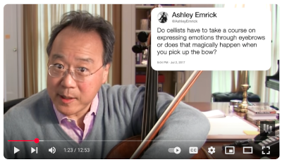
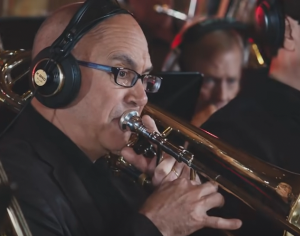

# Audience Engagement 

In my opinion, our job as musicians is to communicate the emotional message of the music to the audience. I see music as a language of emotion, as opposed to a language of information like English. Composers have an emotional message in mind, and we're the conveyors of that message. 

All the details of playing our instrument - breathing, embouchure, technic, articulation, phrasing, etc. - are the crude mechanical means we have to use to communicate the emotional message of the music. Due to the limitations of flesh and metal, those means are imperfect and we must work to minimize the extraneous sounds they produce; but that work is not the end goal of our art.

Even if the piece you're playing doesn't touch you, it's still your job to communicate the emotion the composer intended to the audience. You might need to call upon your innate acting skills. The music won't move the audience if they can see it doesn't move you.  

How to we communicate emotion through music? In part, we do it by demonstrating to the audience that the music moves us. In turn, they will feel moved, as well. If we stand perfectly still and stare straight ahead while we play, we aren't communicating anything on an emotional level. 

## Emotional communication 

Most professional euphonium soloists that I'm aware of tend to stand still while performing. Even if they make no mistakes at all, it still feels as if something is missing. (There are some exceptions, such as Anthony Caillet and Soichiro Tonomura.)

Take a look at these examples of musicians and see whether you feel as if they're communicating the emotional content of the music as they play. What are they doing differently from most euphonium players you've seen perform? 

Alessandro Beverari, clarinet  
[E. Morricone, "Nuovo Cinema Paradiso"](https://www.youtube.com/watch?v=Ws7Yj1BuXRI)

Yo-Yo Ma, cello  
[Camille Saint-Saens, "The Swan"](https://www.youtube.com/watch?v=3qrKjywjo7Q)

Katharina Mätzler, bassoon  
[W.A. Mozart, "Concerto in Bb Major"](https://www.youtube.com/watch?v=TLQpI6nULdg)  
Note: I think of this as Mozart's Euphonium Concerto. The euphonium hadn't been invented at the time he composed it. That goes to show he was ahead of his time.

Bertrand Chamayou, piano  
[Maurice Ravel, "Pavane for a Dead Princess"](https://www.youtube.com/watch?v=cwL4nSb9am8)  
How do we communicate engagement with the audience when the music is nuanced? Chamayou communicates a lot of emotion through posture and facial expressions. Beverari and Mätzler move quite a bit as they play. Is it too much? It's a matter of personal preference.

Gautier Capuçon, cello  
[Gabriel Faure, "Sicilienne"](https://www.youtube.com/watch?v=1oZY4OJ4R-Y)  
Another example of good engagement with the music without excessive body movement. We don't want to be stock-still, but we don't want to distract the audience's attention from the music, either.

### The eyebrows have it

 

Yo-Yo Ma answering Twitter questions, 2021.

 

Joe Alessi, principal trombone with the New York Philarmonic, using his eyebrows during the 2019 recording of "Rains of Castamere" for the Epic Low Brass event.

## Who or what to look at 

Let's set aside the question of nervousness. That's covered on a separate page about [managing nerves](managing-nerves.md). Assuming you're managing your nerves, how do you connect with the audience on a personal level? 

It's mainly a question of who and what you look at while you perform. Some of the time, you'll be swaying with the music with your eyes closed, but much of the time your eyes will be open. 

There are two situations to consider. First, you may be playing as part of an ensemble. If the ensemble has a conductor, your attention will mainly be on the conductor, and you'll glance at your music from time to time. You don't need to look directly at the audience unless the conductor points you out to take a bow at the end of a piece. 

If the ensemble doesn't have a conductor - maybe it's a small chamber ensemble - you'll be looking at the other members of the ensemble while you play. That helps everyone stay together. Then you'll look out across the audience when you take your bows. 

When you're the featured soloist, it's a different story. Now you have to make each member of the audience feel as if you're playing just for them. 

Fortunately, that isn't as hard as it may sound. You do the same thing many public speakers do. 

Audience members who are close enough to the stage to see your face clearly will be able to tell when you're looking directly at them. 

The people farther away in the auditorium or in an outdoor area can't tell exactly who you're looking at. When you look at a section of the audience, each person in that section gets the impression you're looking directly at them. 

Public speakers deliver each phrase of their presentation to a different section of the audience (for the middle and rear area) or to an individual (in the closer areas). When they shift their gaze, they take care not to do it in a predictable way. Otherwise, people will stop listening to the talk and start guessing where the speaker will look next. 

Performing as a soloist in front of a large audience works in the same way. You play each phrase of the music directly to a person seated near the stage or to an area of the auditorium farther from the stage. Shift your gaze in a more-or-less random way, so people won't start anticipating where you will look next.

Vary the time you spend looking at any given part of the audience, so people won't start timing you and waiting for you to look elsewhere. 

## Finishing 

When they reach the end of a piece, many musicians simply stop playing. It's as if they are robots that are switched off abruptly upon releasing the last note. 

It's more effective to "milk" the last phrase of a piece. If it's a slow, quiet ending, hang onto it as if the music is gripping you, and you can't let it go. Hold the final facial expression for a couple of seconds and reluctantly lower the instrument. If it's a loud ending in a fast piece, maintain the instrument in position for a couple of seconds before lowering it with a bit of a flourish. 

The trick here is that the audience will remember the thoughtful or triumphant conclusion of the piece and forget all the mistakes you made along the way. The way you finish will stick in their memory as they leave the venue. Give them a strong ending to remember. If you give them a weak ending, they'll look for something else to remember instead...like your mistakes.

