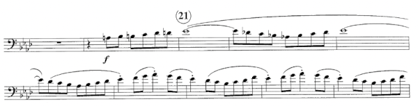

# Example 2: Festive Overture 

This is the beginning of an excerpt from the euphonium part in Donald Hunsberger's transcription of _Festive Overture_, by Dmitri Shostakovich. The snippet doesn't show the top of the first page, so we don't see the composer's name or the tempo indication, but I'll fill those in for you. You would see them if you were reading the actual part.

This excerpt comes up in nearly all concert band auditions for euphonium players. Many students woodshed this part one bar at a time, hundreds of times, before they feel confident in playing it. 

Are there some clues that can help us do a little better than that? 

#### Example 2, Clue 1: Title 

The title of the piece, _Festive Overture_, gives us a hint as to the emotional intent of the music. This is something celebratory and happy. Knowing this helps us approach the music appropriately even on first reading.

#### Example 2, Clue 2: Composer's name 

Dmitri Shostakovich is a very well-known composer who worked in the first half of the 20th century. He's best known for large-scale orchestral pieces, but also wrote many other types of music for various ensembles. 

Knowing a little about his general style of composing can help us sight-read this excerpt with the appropriate style. 

#### Example 2, Clue 3: Time signature 

If you were looking at the complete part, you would see the time signature is cut time, or 2/2, which means there are two half notes per bar. 

Cut time is usually used for faster music, but not always. What about this piece?

#### Example 2, Clue 4: Tempo 

The tempo is marked as _Presto_ with a metronome setting of half note = 152 beats per minutes. That's two clues in one. 

_Presto_ is faster than _allegro_, and the metronome marking is also somewhat faster than an _allegro_ tempo, which would usually range from about 120 to 144. 

But it's also not breakneck speed. It's a smooth, bright tempo. If it were much faster than 152, it wouldn't be _festive_ so much as _frenetic_ or _terrifying_. That isn't the style. 

#### Example 2, Clue 5: Key 

We know from studying music history (and possibly from playing this piece in orchestra) that the original key is A Major. The well-known Hunsberger transcription for concert band shifts the piece down a half-step into Ab Major. 

We can see the key signature of 4 flats suggests Ab Major (or F minor). But would a minor key be "festive?"

Looking at the notes and possibly sight-singing them to ourselves, we "hear" music that sounds major rather than minor. 

Apart from the chromatic lead-up to the theme, we can see (and "hear") this passage consists mostly of segments of the Ab major scale. That's a scale we practice every day, and often faster than this. 

A good deal of Western music is built from common building blocks like scales and repeating patterns of intervals. This music is like that. It's almost, but not quite, "just" Ab major scales over and over again. (Note: "Just" is a dangerous word.)

That chromatic lead-up gives many students trouble. My observation is that this is mainly because those notes are not slurred. Many students overthink tonguing at this tempo, and stress themselves out. 

I often hear people play that initial run as fast as they can possibly flap their tongues, and louder than necessary due to self-inflicted stress, and then settle into the tempo after starting the slurred part. Relax. It's all the same tempo. 

At this tempo, we will almost certainly double-tongue that run. Many students don't practice articulation carefully, and their double-tonguing is sloppy. So, this is a skill we need to work on in order to tackle music like this without having to drive it out note by note. 

There's also mental or emotional control involved. We need to stay relaxed and not freeze when we're looking at a fast run. 

#### Example 2: Summary 

It's probably clear that the key to sight-reading music like this is to practice the fundamentals every day. Everything in the excerpt is something we would generally cover in everyday practice. 

