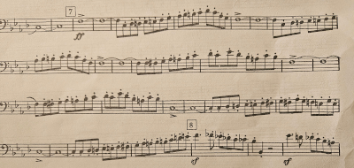
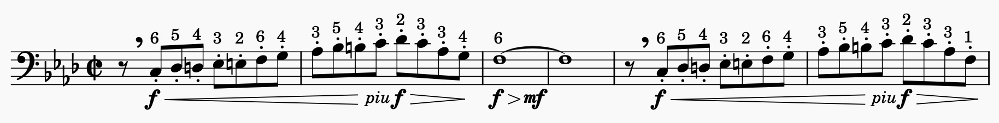
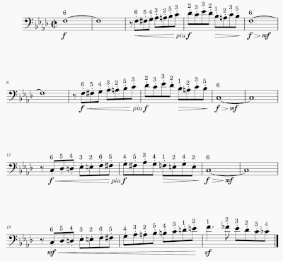

# Example 3: Rossini, _William Tell_ Overture 

This is a portion of the 3rd trombone part in the band transcription of Rossini's _William Tell_ Overture. 

#### Example 3, Clue 1: Composer's Name 

Gioachino Rossini is best known for his operas, of which he composed 39 starting at the age of 18. All his work has a similar style, and it's a very familiar style. 

Knowing this is a Rossini piece gives us a big head start on playing it with the appropriate interpretation and expression, even the first time through.

Increasing your knowledge of music history and of the styles of specific composers will improve your sight-reading ability. 

#### Example 3, Clue 2: Time signature 

The time signature is cut time or 2/2, meaning there are 2 half notes per bar and each beat is a half note. 

#### Example 3, Clue 3: Tempo 

This section of the piece is marked _allegro_. No specific metronome setting is indicated. 

We know from our previous experience watching cartoons that _William Tell_ can be played at a lightning-fast tempo. But for purposes of a concert, we don't want to do that. We aren't accompanying a cartoon. 

A tempo of half note = 126 beats per minute or thereabouts is appropriate. 

That tells us we needn't stress over the eighth note passages. They are at a tempo that's comfortable for single tonguing, and there won't be any impossible slide movements. 

#### Example 3, Clue 3: Key 

Based on the time period of the music, we know it's almost certainly in a Major or minor key. The key signature suggests either Ab Major of F minor. 

Which is it? Glancing over the section of interest, starting at rehearsal number 7, we see the phrases land on F and later C, the dominant of F, culminating in a key change to Bb minor at rehearsal number 8. Bb is the subdominant of F. So by all appearances, this is in F minor.

Between 7 and 8 we're looking at diatonic runs - basically scales - in F minor, F Major, and C Major. We practice all those every day. The music isn't _merely_ scales; there are some slight variations from plain scales. 

On the whole, it's _basically_ scales, and we know how to play those. Even if we slip on a couple of notes on first reading, we'll get the gist of the music.

#### Example 3, Clue 4: Ensemble blend

In many cases (maybe most cases), we don't really know what the rest of the ensemble is doing when we first read an unfamiliar piece of music. 

But in this case, the music as such is not entirely unfamiliar. We know a number of other instruments are playing in unison with us. In the band version, that includes the rest of the trombone section, the euphoniums, and the lower and middle woodwinds. 

Why is this a clue? Take a look at the dynamic marking. It's _fortissimo_. Do you think it's necessary (or helpful) for every individual in half the band to be blasting away as loudly as they can? 

Most trombonists lose control when they approach their loudest possible dynamic level. They will tend to slow down and go off tempo. They also tend to splat the notes, and they run out of air quickly.

We can back off a little and play _forte_, and the overall effect will still be _fortissimo_ as far as the audience is concerned. 

#### Example 3, Clue 5: Articulation 

Notice the _staccato_ markings over the eighth notes. How do we interpret those? Given the composer, the time period, and the general style of the music, we understand the dots mean _leggiero_, and not "hammer each note as hard as possible" or "splat the notes and stop them with your tongue."

At the indicated tempo, this means we're going to maintain a steady stream of air and lightly interrupt the flow with our tongue to achieve a _leggiero_ effect in a low-stress, relaxed way. 

#### Example 3, Clue 6: Implications about slide positions 

Many players stick to the basic slide positions when first reading an unfamiliar piece. Once they gain some familiarity with the music, they start to explore alternate positions that can make the piece easier to play. 

We can do better than that when sight-reading. Keep in mind a few rules of thumb. 

First, we want to minimize changes of direction in slide movement. 

Second, we want to choose slide positions based on the music that _follows_, so we're setting ourselves up for the next note or phrase. 

Third, and subordinate to the second point, we want to minimize the distance we have to move the slide between notes. 

If we look over the passages before we sight-read them, we can see hints about this. The notes themselves guide us toward reasonable choices of slide positions. 

For instance, look at bars 2 and 3 on the third line of the excerpt. As we go from bar 2 to bar 3, we play C4 - Bb3 - C3. If we play C4 in 3rd position, the shortest distance to a Bb3 is 1st position. 

But then we're in trouble at the beginning of the ascending run in bar 5. So we might plan to play the C4 in 3rd, the Bb3 in 5th, and the C3 in 6th. 

We can _plan_ our approach to moving passages before we start playing the music. This might sound like a lot of details to remember. It _is_ a lot of details, but if we think about things like this all the time while we're practicing, it will become second nature. 

As our eyes fall across each phrase, our brains will register hints about slide positions naturally. We really only need to do this for passages that look as if they might be challenging. 

#### Example 3, Clue 7: Shape of the phrases

Another thing we can do to make the performance more musical is to introduce a dynamic swell in each of these phrases, with a _crescendo_ as the phrase ascends and a _decrescendo_ as it descends. 

At this point you might ask how we can possibly know to do that when we're reading the music for the first time ever. 

Well, we can know because we can see that the phrases ascend and descend, and we have enough experience to understand what that implies in the context of music from this period. 

We also know there's no value in blasting those whole notes, even if they're marked _fortissimo_. To help us stay on tempo and to sneak in a quick breath, we need not hold the long notes all the way through the tied eighth notes. 

We can see these two phrases are identical except for the last eighth note in the sequence. That means we don't have to stress over the second phrase.

Assembling the pieces we have until now, we're planning to play these two phrases as shown below, even before we've played the piece for the first time: 

Notice we never go all the way to _fortissimo_ even though the music is marked _fortissimo_. In context, that would be overkill and we would risk breaking tempo, missing notes, or sounding rough. 

We have to change slide directions three times on the way up, but the distances are minimal. We've chosen slide positions that avoid long distances when we change direction. 

We'll use a relaxed, flexible slide technique instead of trying to jam the slide precisely into position for each individual note (see [Trombone Posture](trombone-posture.md)).

We'll apply musical phrasing with a dynamic swell that follows the shape of each phrase. 

We'll use a light touch with single-tonguing to tap each note without halting our air stream. 

We'll use the technique of [short, quick breaths](breathing.md) to grab air at the end of each long note. The gap will also help us stay on tempo when we enter with the second eighth note of the bar.

Now let's apply the same thinking to the next phrases. 

We have enough knowledge to play the music expressively, even if it's our first time and we miss a few notes along the way. 

If you're sight-reading in an audition situation, you will present yourself better if you demonstrate that you can play expressively on first reading than if you nail every note in a non-musical way. 

If you're sight-reading in a rehearsal situation, you'll save the ensemble some rehearsal time by getting the musical style right earlier rather than later. 

If you're sight-reading as part of individual practice, you'll gain precious time to focus on musicality rather than fighting with the notes. 

#### Example 3: Summary 

To prepare to sight-read this kind of music, we need to work daily on several fundamentals. These include scales, musical phrasing, dynamic control, breathing techniques, clean articulation, and knowledge of music theory and history.