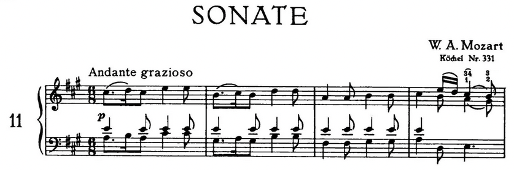
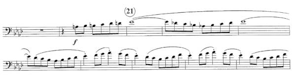

# Clues for Sight-Reading 

Assuming we develop our sight-reading skills to the point that we aren't struggling to pick out individual notes, we can start to play unfamiliar music in an appropriate style by paying attention to clues that are almost always available in the sheet music. 

## Example 1: W.A. Mozart, _Sonate_ K. 331

Let's start with an example. Here's the top of the first page of Wolfgang Amadeus Mozart's _Sonate_, K. 331. This is not written for euphonium or trombone, but it illustrates the idea of looking for clues. 

There are things you have to learn about music in order to recognize the clues. All the necessary skills can be developed through reading, individual practice, and private lessons. 

#### Example 1, Clue 1: Composer's name

The first clue is the name of the composer. Knowing the piece was written by Mozart gives us a good idea of the general character of the music and how we should interpret it. 

To understand that clue, you need to learn a bit about music history and the styles of major composers. 

From this, we know the piece is likely to be light rather than ponderous or bombastic. 

#### Example 1, Clue 2: Time signature 

The piece is marked 6/8, which means there are six 8th notes to a bar. Music written in 6/8 may have a 6-beat feel or a 2-beat feel, depending on tempo. So we need to look for a clue about the tempo.

#### Example 1, Clue 3: Tempo 

This music doesn't specify a metronome setting, but it gives a tempo indication in the form of Italian musical terms: _andante grazioso_. 

To understand this clue, we need to learn a bit about Italian musical terms.

_Andante_ means "walking speed" and _grazioso_ means "graceful." From this we know the piece doesn't go at a fast 2 like a Sousa march, and it isn't supposed to be heavy or punchy. 

On the other hand, it also doesn't go at a particularly slow speed. We don't walk gracefully at a painfully slow pace. We would fall over.

We'll probably be in the neighborhood of 8th note = 126 to 136 beats per minute. We could "feel" it in a relaxed 2 or a moderate 6. 

#### Example 1, Clue 4: Key 

Music of Mozart's period generally stays in one key up to a point and then modulates to the 5th of that key before returning to the original key to finish up. 

So, what key is this piece in? We have two clues: the _key signature_ and _cadences_. 

To understand the key signature we need to learn a little bit about music theory and history. In the case of Mozart's music, we're interested in _major_ and _minor_ keys, because those are what he used nearly always.

Knowing the _circle of fifths_ helps us understand which key the music is in. In this case, the key signature has three sharps - F#, C#, and G#. That tells us the music is either in A Major or F# minor.

So, which is it? We need to look through the music to find the _cadences_; the places where the music comes to a logical conclusion, in the same way as a sentence might contain commas and semicolons before finally arriving at a period. 

The snippet in the example starts with an A major chord and comes to a cadence at the end of the line that looks like E major - the dominant of the key of A major. So, this appears to be in A Major rather than F# minor. 

Knowing a little about music theory helps us understand this clue. Besides that, sight-singing enables us to "hear" the music in our mind before we attempt to play it. No surprises! 

In fact, if we silently sight-sing the top line, which is the melody, we can tell it's in a major key rather than a minor key. 

#### Example 1: Summary 

The music contains notes and rhythmic patters. Unless we're absolute beginners (which we all are at some point), we should not have to struggle with the notes or the rhythmic patterns in this piece. 

We've seen each of these notes thousands of times before, even if we haven't seen them arranged in precisely this order. 

It's analogous to reading English. We've seen all the letters thousands of times. When we see an unfamiliar word, we don't have to think very hard about each letter. 

There are no unusual rhythmic patterns here. We don't have to work out any complicated patterns. It's all routine.

For this kind of music, the raw translation from written to aural music should not require our full attention. We can think actively about appropriate interpretation and expressive playing. 

## Example 2: Festive Overture 

This is the beginning of an excerpt from the euphonium part in Donald Hunsberger's transcription of _Festive Overture_, by Dmitri Shostakovich. The snippet doesn't show the top of the first page, so we don't see the composer's name or the tempo indication, but I'll fill those in for you. You would see them if you were reading the actual part.

This excerpt comes up in nearly all concert band auditions for euphonium players. Many students woodshed this part one bar at a time, hundreds of times, before they feel confident in playing it. 

Are there some clues that can help us do a little better than that? 

#### Example 2, Clue 1: Title 

The title of the piece, _Festive Overture_, gives us a hint as to the emotional intent of the music. This is something celebratory and happy. Knowing this helps us approach the music appropriately even on first reading.

#### Example 2, Clue 2: Composer's name 

Dmitri Shostakovich is a very well-known composer who worked in the first half of the 20th century. He's best known for large-scale orchestral pieces, but also wrote many other types of music for various ensembles. 

Knowing a little about his general style of composing can help us sight-read this excerpt with the appropriate style. 

#### Example 2, Clue 3: Time signature 

If you were looking at the complete part, you would see the time signature is cut time, or 2/2, which means there are two half notes per bar. 

Cut time is usually used for faster music, but not always. What about this piece?

#### Example 2, Clue 4: Tempo 

The tempo is marked as _Presto_ with a metronome setting of half note = 152 beats per minutes. That's two clues in one. 

_Presto_ is faster than _allegro_, and the metronome marking is also somewhat faster than an _allegro_ tempo, which would usually range from about 120 to 144. 

But it's also not breakneck speed. It's a smooth, bright tempo. If it were much faster than 152, it wouldn't be _festive_ so much as _frenetic_ or _terrifying_. That isn't the style. 

#### Example 2, Clue 5: Key 

We know from studying music history (and possibly from playing this piece in orchestra) that the original key is A Major. The well-known Hunsberger transcription for concert band shifts the piece down a half-step into Ab Major. 

We can see the key signature of 4 flats suggests Ab Major (or F minor). But would a minor key be "festive?"

Looking at the notes and possibly sight-singing them to ourselves, we "hear" music that sounds major rather than minor. 

Apart from the chromatic lead-up to the theme, we can see (and "hear") this passage consists mostly of segments of the Ab major scale. That's a scale we practice every day, and often faster than this. 

A good deal of Western music is built from common building blocks like scales and repeating patterns of intervals. This music is like that. It's almost, but not quite, "just" Ab major scales over and over again. (Note: "Just" is a dangerous word.)

That chromatic lead-up gives many students trouble. My observation is that this is mainly because those notes are not slurred. Many students overthink tonguing at this tempo, and stress themselves out. 

I often hear people play that initial run as fast as they can possibly flap their tongues, and louder than necessary due to self-inflicted stress, and then settle into the tempo after starting the slurred part. Relax. It's all the same tempo. 

At this tempo, we will almost certainly double-tongue that run. Many students don't practice articulation carefully, and their double-tonguing is sloppy. So, this is a skill we need to work on in order to tackle music like this without having to drive it out note by note. 

There's also mental or emotional control involved. We need to stay relaxed and not freeze when we're looking at a fast run. 

