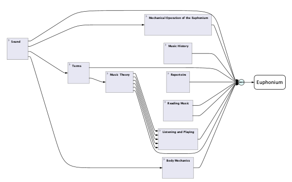
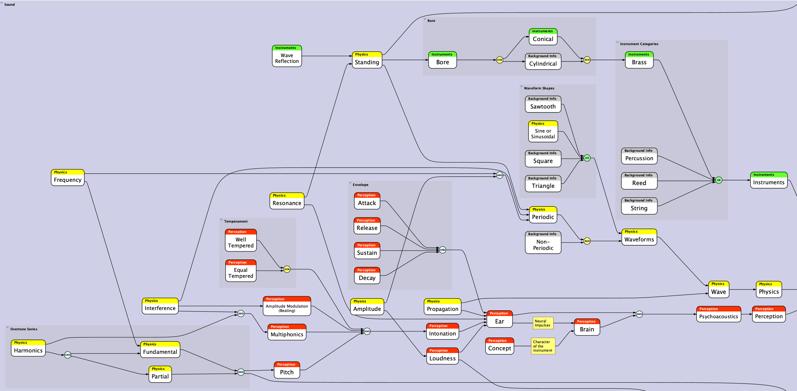

# What do you need to know to master the euphonium? 

To master the euphonium - or at least to become reasonably proficient on it - you need to know a lot about a few things and a little about a lot of things. Here's an overview. 

 

At first glance, it might seem as if you have to earn half a dozen PhD's just to play the thing; but it isn't so daunting. All these topics overlap and reinforce one another, and either directly or indirectly help you play better. 

In the course of private lessons, we'll touch on the information relevant to the skills you're working on at the moment and the direction you're taking with developing your skills to achieve your goals. 

Let's review these topics briefly and see how they apply to playing the instrument. 

## Obvious topics 

Some of the topics shown on the diagram have obvious relevance to playing the euphonium. I think it's safe to say _Mechanical Operation of the Euphonium_, _Reading Music_, _Listening and Playing_, _Body Mechanics_, and _Terms_ (that is, musical vocabulary) are pretty obvious. 

I mean, if you didn't know how to hold the instrument, breathe, operate the valves, produce a sound, read music, or understand musical terms, you'd be pretty much stuck. So, there's no need to belabor those topics.

Some of the other topics might warrant explanation. 

## Sound 

As a musical instrument, the euphonium makes sounds. Therefore, we should understand something about the nature of sound and how the euphonium produces sound. 

There are many elements in this diagram, and it's probably not easy to read on a web page. Suffice it to say the yellow boxes pertain to the physics of sound - _acoustics_ - the red ones pertain to the human perception of sound, and the green ones pertain to how sound works in the instrument. 

Those are the broad areas relevant to understanding sound for purposes of playing the instrument.

The gray boxes represent information that might be of general interest, but that isn't strictly necessary to learn in order to master the euphonium. 

It's good to know that when you play a note, you're sustaining a standing periodic sinusoidal wave in the instrument and in the resonating chamber formed by your oral cavity. 

Of course, you don't need to know that just to make a noise emerge from the bell; but if you want to sound _good_, you'll want to understand how to attain the _timbre_ (tone quality) you're aiming for. 

In turn, that implies you actually _are_ aiming for something. What you're aiming for is your [_concept_](concept-euphonium.md) of the euphonium, which is yet another topic to learn about.

## Music theory and history 

The more you know about music theory and music history, the better able you'll be to express the intentions of composers whose music you're performing. 

## Repertoire 

Your _repertoire_ is the list of all the music you know and can perform. As a euphoniumist, there is standard repertoire you'll be expected to learn at the appropriate stages of your development. 

The repertoire falls into a few categories:

- solo literature 
- band and orchestra excerpts 
- studies or etudes

There are basically three situations in which we play our instruments: 

- performance of music as art (I include university recitals for academic credit in this category)
- auditions 
- contests 

Learning solo literature and excepts of euphonium parts from concert band, brass band, and orchestral pieces directly pertain to the performance of music as art, as well as preparation for contests. Learning etudes contributes indirectly to our performance skills. 

Excerpts and etudes are important for auditions. Most euphonium auditions call for almost exactly the same selections. It's possible to prepare years in advance of important auditions by gradually building our repertoire in these categories. 

Your private teacher should progressively include the standard etudes and solos as your playing skills develop. Your daily practice should include one or two of these, alternating among them, to keep them fresh. 

