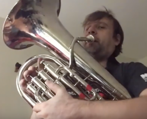
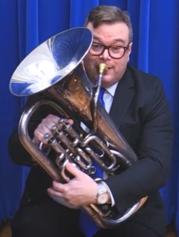

# Euphonium posture

Posture has a profound effect on breathing. There are individual differences in how people hold the euphonium, but some ways enable us to keep our airway straight more easily than others. We want to keep the airway straight so we can achieve maximum control of the air when playing. 

The euphonium is a relatively large and heavy instrument. In addition, some euphonium designs require us to hold the instrument a little bit sideways. Depending on how we hold it, both when sitting and when standing, we may interfere with our ability to breathe freely or to move our fingers flexibly. 

For all designs of euphonium, we want to support the weight of the instrument with our left arm and leave our right arm as relaxed as possible so the fingers can move freely. Let's see how that might look. 

Figure 1: 4-valve non-compensating model with rotary valves front. Rotary valves are popular in Germany.

{width=200px}

Figure 2: 4-valve non-compensating model with piston valves front. This is a 1908 model by Conn.

{width=200px}

Figure 3: 4-valve compensating model with piston valves front. John Powell demonstrating Wessex Festivo.

For figures 1, 2, and 3: The musician supports the weight of the euphonium with the left arm. The placement of the valves in front makes it easy to center the weight of the instrument. 

{width=200px}

Figure 4: 4-valve non-compensating model with valves on top 

Designs with the main three (or all four) valves on top present a challenge for good posture because the center of mass of the instrument is offset from the center of mass of the musician's body. 

The musician supports the weight of the euphonium with the left arm and angles the instrument to make it easier to reach the valves. The right hand is not bearing any weight and can be relaxed. 

{width=200px}

Figure 5: 4-valve compensating model with main valves on top. Soloist Guido Nix in performance.

{width=200px}

Figure 6: 5-valve non-compensating model with main valves on top. Fourth valve operated by left index finger, fifth valve operated by left thumb. 

Figures 5 and 6 depict euphoniums with the three main valves on top and additional valves placed for operation with the left hand. The weight of the instrument is supported by fingers 3, 4, and 5 of the left hand, leaving fingers 1 and 2 free to operate flexibly. This is a consequence of the way the muscles of the fingers, hand, and forearm are connected. 

### Counterexamples 

You will see professionals who use suboptimal techniques and yet sound very good. I would say they must work harder than they should to achieve good results, because they have to overcome the problems caused by poor posture or by using the "wrong" finger for the 4th valve (more on that later). 

The fact these players are successful shows that you don't have to do everything "by the book" to succeed. Just keep in mind you might be making things harder than necessary for yourself.

{width=200px} 

Figure 7: Dr. Paul Carson demonstrates incorrect posture in the seated position. He is resting the instrument on his lap and folding his torso forward. This inhibits breath control. 

{width=200px}

Figure 8: Professional soloist Arisa Makita bends her torso when playing in the standing position. This inhibits breath control. 

### Finger muscles 

In compensating models with the 4th valve on the side and in 5-valve models with 4 and 5 on the side, there's a relationship between posture and the fingers you use to operate the fourth and fifth valves. 

The muscles of the forearm, wrist, and fingers are connected in a fairly complicated way. A useful simplification is to say that fingers 3 (middle), 4 (ring), and to some degree 5 (pinky) are where we obtain a strong grip, while fingers 1 (thumb) and 2 (index) are optimized for flexible, precise actions. 

By using fingers 3, 4, and 5 of the left hand to support the weight of the instrument, we keep the index finger free to operate the 4th valve easily, and the left thumb free to operate the 5th valve (if present). Those are the digits that are naturally optimized for dexterity, due to the way the muscles of the arm and hand are connected. 

Because of the physical construction of the human arm and hand, the choice of finger for operating the 4th valve is not entirely a question of personal preference. When players use finger 3 (middle) of the left hand to operate the 4th valve on a compensating euphonium (or a 5-valve model), they are using the same muscle group for strength (supporting the weight of the instrument) and flexibility (operating the 4th valve), because fingers 3 and 4 are tightly connected with each other as well as with the muscles of the forearm. 

That will _work_, sort of, but the player will become tired faster than necessary. The natural response when we get tired in that way is to slouch in an attempt to support the weight of the instrument against our body (when standing) or on our lap (when sitting). That "folds" our torso and bends the internal body parts that produce our air flow. 

{width=200px}

Figure 9: Hiram Diaz, solo euphonium with the U.S. Marine Band, uses finger 3 to operate the 4th valve. 

{width=200px}

Figure 10: Jan Jochems, soloing with the Mongomery County Concert Band, uses finger 3 to operate the 4th valve.

Clearly, you can succeed on the instrument playing this way, but in both these cases the musicians would have an easier time of it if they exploited the natural mechanics of the human arm and hand more effectively. 

These two players are standing correctly and are not having difficulty managing their air flow. This is because they have developed sufficient physical strength to support the instrument for a long time. 

Young students, amateurs with limited time available to practice, and older people (possibly including these two players at a future time) may not be able to support the instrument that well, and may be susceptible to slouching.

It's an easy change to use finger 2 instead of finger 3 for the 4th valve.

Another issue commonly occurs when we become tired of holding up the weight of the instrument. We tend to hook our right thumb and pinky under the grip located in front of the three main valves to help hold the instrument up. That reduces the flexibility of the fingers of our right hand and interferes with our ability to play technical passages. 

Details like this - which finger to use for which valves, depending on which design of the euphonium you're playing - are relevant to developing performance skills because they affect your ability to breathe properly and to operate the valves freely. 