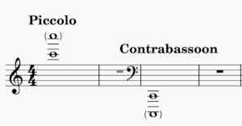
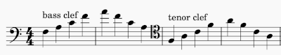

# Western musical notation 

Western music is notated in a consistent way. That makes it possible to internalize the notational conventions such that we need not think about all the written indications consciously when we're reading music. The translation from written music to sound "just happens." 

This is analogous to the way we read text. When we're first learning to read, we have to think consciously about what each letter and sequence of letters represents. After a while, we don't have to think about it on that level anymore. We can think about the _content_ of the text even while we're reading it for the first time.

This is because there are standard orthographical conventions for the human language we're reading. For the English language, the spelling of many words follows a pattern that we can learn, while we must recognize certain other words at sight because they deviate from the standard patterns. Once we have learned these things, reading becomes automatic. Reading music is a similar experience.

Of course, to get to that point with our reading skills requires practice; but the benefit is significant - it leaves our conscious mind free to focus on the interpretation and expression of the music, rather than the crude details of the notation. 

## Western musical notation 

Over the centuries, people have invented various ways to capture music in written form, for future reference. Some conventions became widely used while others fell out of use. 

The result is a kind of hodge-podge of symbols and markings that looks a bit confusing at first glance, but actually amounts to a consistent way of notating music. 

You can think of musical notation as a spreadsheet or perhaps a two-dimensional graph. The rows of the spreadsheet (or the x-axis of the graph) represents _time_. The columns (or y-axis) represents the notes to be played at each moment of time.

So, musical notation like this: 

means to play a C for 1 second, then a D for 1 second, then an E for 2 seconds. 

When you're first learning, you might have to think consciously about how to produce the notes on your instrument and how long to hold each note, but after a while this becomes automatic. 

There are other symbols in the example that haven't been explained, but they are all standard, and once you learn them you never forget them.

## Staves and clefs 

Say we wanted to write music in a "spreadsheet" style, and we decided to use horizontal lines as a guide. Given an infinite number of horizontal lines, we can write an infinite number of notes on and between the lines. 

But that would be very hard to read. Human vision doesn't handle a mass of closely-spaced parallel lines very well. Staring at that sort of pattern makes us dizzy.

People decided to separate out a limited number of lines to make it easier to read the music. Some used four lines and some used five. Eventually, five lines became the standard convention. We call this set of five horizontal, parallel lines a _staff_. The example above shows a staff.

The notes are written on the lines or in the spaces between the lines. Notes higher in pitch are written higher on the staff, and notes lower in pitch are written lower on the staff. 

When a note doesn't "fit" on the staff, we add a short line, called a _ledger line_, so we can write notes above or below the staff. The first note in the example, a C, illustrates the use of a ledger line. 

So far, so good. But how can we tell which note is represented by each line and space? I call those three notes C, D, and E, but how do I know those are the right notes?

We need some way to indicate where the staff is positioned among the infinite number of possible notes. For that, we use a "key." 

In this context, we mean "key" in the sense of a _legend_ on a map or diagram, and not "key" in the sense of a musical key like A Major or F Minor. 

In the example, the swirly symbol on the left indicates that the note "G" is positioned on the second line from the bottom. We use an old word for "key", _clef_, for this kind of symbol. 

There was a time when that symbol, or an earlier version of it, resembled the letter G. For that reason, it's called a _G clef_. Originally, people were doing nothing more complicated than writing the letter G on the line where they intended to write the note G. 

## The Great (or Grand) Staff 

When keyboard instruments became standardized and common (organ, harpsichord, and later piano), people started to use the center of the keyboard as a reference point for notes and for musical notation. 

They decided that the center of the keyboard was "middle C," and they agreed that music for keyboard instruments would be written on a pair of staves that they called the Great Staff or Grand Staff. 

There's middle C, in the middle of the keyboard and in the middle of the two staves that make up the Great Staff. 

The lower of the two staves has a different _clef_ sign than the upper one. That one is called an _F clef_ because it shows the position of the note "F" on the staff, and earlier versions of the symbol resembled the letter F. It shows the F below middle C is written on the fourth line of the lower staff. 

Unless otherwise indicated in the written music, a G clef always points to the G just above middle C, and an F clef always points to the F just below middle C.

## Scientific Pitch Notation 

After the piano was invented in the early 18th century, the Great Staff or Grand Staff became the reference point for written European or "Western" music. The standard 88-key keyboard became the reference for naming the _octaves_ in Western music, too. 

This image (borrowed from allaboutmusictheory.com) illustrates the note naming convention defined by the Acoustical Society of America. They call it Scientific Pitch Notation.

Here's where the various C's appear on the Great Staff:

## Why C and not A?

Why is C the basic note instead of A? After all, A is the first letter of the alphabet. 

If we play only the white keys on a piano starting on C and going up to the next C, we get a _major scale_, also called the _ionian mode_. 

Speculation has it that before the Renaissance, the _ionian_ mode was not popular. The _aeolian_ mode was the most popular. That's what you get when you play the white keys from A to A. 

So, in those days it made sense to say A was the most basic starting note, and it was named for the first letter of the alphabet. Later, it made more sense to think of C as the most basic starting note. That's where we are today.

## Euphonium and trombone 

Where do the euphonium and trombone fit into this scheme? 

The euphonium and trombone are both based on Bb. The bore is 9 feet long, and a single standing wave 9 feet long sounds at the pitch of Bb1. 

If you divide that wavelength in half, two waves will fit into the 9-foot tube, sounding at a pitch of Bb2. Divide the fundamental into thirds, and you get F3; into fourths, you get Bb3; and so on. There's more information about this on the [acoustics](images/acoustics.md) page. 

## Adjustments for instrument range 

Some instruments play much higher than the middle range of the piano, and some instruments much lower. It's difficult to read music that has more than about four (4) ledger lines. So, Western musical notation makes adjustments for some instruments.

The convention emerged that the parts for certain high instruments were to sound one or two octaves higher than written, and the parts for certain low instruments were to sound one octave lower than written. 

Music for xylophone, glockenspiel, and piccolo sounds one octave higher than written. Music for celesta sounds two octaves higher than written. Music for contrabass (double bass or string bass), contrabassoon, and some other "contra-" instruments sounds one octave lower than written. 

The treble clef makes sense for the violin and the bass clef makes sense for the cello. But the middle range of the viola doesn't quite fit onto the treble or bass clef staves. 

So, music for viola moves the staff to center it on the middle range of the instrument. Another clef, called a _C clef_, marks the line on which the _middle C_ (C4) is written. When the C clef brackets the third line of the staff, it's called _alto clef_. 

Alto clef is relevant to the trombone, because in the 19th century most orchestral music called for alto trombones based on Eb or D rather than tenor trombones based on Bb. 

Their middle range was a fourth or fifth higher than that for a modern-day tenor trombone. Writing their parts in bass clef would have resulted in too many ledger lines to be easily readable. 

Alto clef is relevant to the euphonium because we often play music written for trombone, and we may encounter alto clef from time to time.

## Clef position on the staff 

Originally, the clef signs could be placed anywhere on the staff; that is, on any _line_. Clef signs never mark a _space_ on the staff. 

Early on, the G clef (treble clef) position stabilized on the second line of the staff. It never appears elsewhere on the staff. 

After some time, the F clef came to be used only for the third or fourth line of a staff. When it marked the third line, it was called "baritone clef." When it marked the fourth line, it was called "bass clef." Today, the F clef is always positioned on the fourth line, and is called "bass clef." 

Originally, the C clef could be positioned on any line of the staff. Today, it appears either on the third line (alto clef) or fourth line (tenor clef). 

Tenor clef is relevant for instruments that generally play in the low register, but may also play in a range that isn't convenient to write in bass clef. Yet, they don't go so high that alto clef makes sense. Tenor clef is between the two. 

Music for trombone, euphonium, bassoon, and cello frequently changes between bass clef and tenor clef. This is an F major arpeggio written first in bass clef and then in tenor clef. 

## Transposing parts 

Many different instruments have been invented over the past several centuries. Some of them were designed to be "families" of instruments, with smaller versions playing higher notes and larger versions playing lower notes. 

This was the case for recorders, oboes, and clarinets. For instance, the piccolo, soprano, and bass recorders were pitched on C, while the tenor recorder was pitched on F. Similarly, there were Eb, A, Bb, and F clarinets. 

The instruments were built so that the same (or mostly the same) fingerings could be used on small and large variants. In principle, that enabled a musician to switch from one to another as demanded by the music in hand. 

But all the parts were written in "concert pitch;" that is, the written notes were the same as they would be on a piano. So the musicians had to transpose their parts mentally to play instruments not based on C. 

The convention emerged to write all the music for such instrument families in treble clef, transposed to match the pitch on which the instrument was based. That way, the fingerings for the written notes were the same for all sizes of instruments in a given instrument family. 

Thus, a written C for a clarinet in A actually sounded a concert A, and a written C for a basset horn (a mid-sized clarinet in F) sounded a concert F. 

The same applies to modern-day instruments. A written C for a clarinet in Bb sounds a concert Bb, and a written C for an alto clarinet in Eb sounds a concert Eb. The same player can play both instruments using the same fingerings. 

When brass instruments became popular in the 19th century, instrument makers followed the same approach to build families of brass instruments. 

[More on that on a separate page.](transposing-parts.md)

