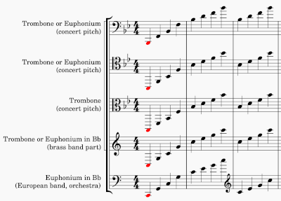

# Sight-reading 

Sight-reading is the process of converting musical notation into the sound the notation represents. We look at the notation and realize the music _via_ our bodies and instrument. 

The written music is _input_ and the performed music is _output_. We ourselves are the machine that converts the input into the output.

## How well are we expected to sight-read? 

Most people assume that when reading music we haven't seen before, we must be expected to stumble and make mistakes. We might have to disassemble the music into small segments and practice each segment dozens or hundreds of times before we are able to perform the music. 

I disagree with that assumption. In my opinion, we should be able to play most Western music more-or-less correctly at sight. Exceptions include unusual musical genres that vary from the usual conventions, and music that is exceptionally challenging technically. 

When we "woodshed" a piece, our goal is to polish the performance, not merely to learn the notes by rote.

My private teaching includes explicit practice of sight-reading with the goal to make the translation from notation to sound as automatic and natural as possible. 

What makes this a realistic goal? A couple of things.

- western musical notation follows consistent conventions [(read more)](music-notation.md) 
- transposing parts for brass instruments follow the same pattern [(read more)](transposing-parts.md)

## Euphonium/trombone notation

C clefs are not used in transposed parts. Transposed parts always use treble or bass clef. 

Clefs may change in any given part as the music moves higher or lower. 

## Clues for sight-reading 

Written music contains clues that can help us sight-read the _music_ and not just the _notes_. 

Where do we look for clues in the written music? I've prepared some examples to illustrate how we can find clues to help us sight-read music effectively.

- [Example 1: Mozart _Sonate_, K 331 (general)](clues-example-1.md)
- [Example 2: Shostakovich _Festive Overture_ (euphonium)](clues-example-2.md)
- [Example 3: Rossini _William Tell_ (trombone)](clues-example-3.md)

