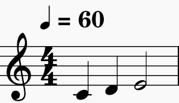

# Sight-reading 

Sight-reading is the process of converting musical notation into the sound the notation represents. We look at the notation and realize the music _via_ our bodies and instrument. 

The written music is _input_ and the performed music is _output_. We ourselves are the machine that converts the input into the output.

## How well are we expected to sight-read? 

Most people assume that when reading music we haven't seen before, we must be expected to stumble and make mistakes. We might have to disassemble the music into small segments and practice each segment dozens or hundreds of times before we are able to perform the music. 

I disagree with that assumption. In my opinion, we should be able to play most Western music more-or-less correctly at sight. Exceptions include unusual musical genres that vary from the usual conventions, and music that is exceptionally challenging technically.

My private teaching includes explicit practice of sight-reading with the goal to make the translation from notation to sound as automatic and natural as possible. What makes this a realistic goal?

## Consistent notation

Western music is notated in a consistent way. That makes it possible to internalize the notational conventions such that we need not think about all the written indications consciously when we're reading music. The translation from written music to sound "just happens." 

This is analogous to the way we read text. When we're first learning to read, we have to think consciously about what each letter and sequence of letters represents. After a while, we don't have to think about it on that level anymore. We can think about the _content_ of the text even while we're reading it for the first time.

This is because there are standard orthographical conventions for the human language we're reading. For the English language, the spelling of many words follows a pattern that we can learn, while we must recognize certain other words at sight because they deviate from the standard patterns. Once we have learned these things, reading becomes automatic. Reading music is a similar experience.

Of course, to get to that point with our reading skills requires practice; but the benefit is significant - it leaves our conscious mind free to focus on the interpretation and expression of the music, rather than the crude details of the notation. 

## Western musical notation 

Over the centuries, people have invented various ways to capture music in written form, for future reference. Some conventions became widely used while others fell out of use. 

The result is a kind of hodge-podge of symbols and markings that looks a bit confusing at first glance, but actually amounts to a consistent way of notating music. 

You can think of musical notation as a spreadsheet or perhaps a two-dimensional graph. The rows of the spreadsheet (or the x-axis of the graph) represents _time_. The columns (or y-axis) represents the notes to be played at each moment of time.

So, musical notation like this: 

means to play a C for 1 second, then a D for 1 second, then an E for 2 seconds. 

When you're first learning, you might have to think consciously about how to produce the notes on your instrument and how long to hold each note, but after a while this becomes automatic. 

There are other symbols in the example that haven't been explained, but they are all standard, and once you learn them you never forget them.

