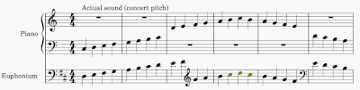

# Transposing parts 

As mentioned on the page about [Western musical notation](music-notation.md), written music for families of similar instruments is usually written in treble clef with each part transposed to match the pitch on which the instrument is based. The intent is to enable all the instruments of the family to be played using the same fingerings for the written notes, even if the written parts are not in concert pitch. 

After the invention of valves for brass instruments, instrument makers began to build families of brass instruments following the same logic. 

For any brass instrument that has valves, the second valve lowers the pitch by a half step; the first valve lowers the pitch by a whole step; and various combinations of valves lower the pitch in the same relative way regardless of the size of the instrument. 

When brass bands became popular early in the 19th century, it was expected that most of the band members could switch from one instrument to another, since they could use the same fingerings for the written notes regardless of the pitch of the instrument. 

Brass instruments were based on Eb and Bb, with larger ones playing lower notes. The Eb cornet was at the top, then the Bb cornet, then the Eb alto, then the Bb baritone (and later the euphonium), then the Eb tuba, and finally the Bb tuba. 

For each of these, the written middle C in treble clef was played open, and sounded the second partial. So when playing a written C, the Eb cornet sounds concert Eb4; the Bb cornet sounds Bb3; the alto horn sounds Eb3; the baritone horn sounds Bb2; the Eb tuba sounds Eb2; and the Bb tuba sounds Bb1.

 

This remains the convention for Brass Band music. The euphoniums and the tenor trombonists read treble clef parts in Bb, sounding a major 9th below the written notes (as a pianist would read them). 

This is one way music may be written for your instrument(s), and you need to learn to read it. 

In concert band music, euphonium parts are usually available either in bass clef, sounding as written (concert pitch), or in treble clef transposed to Bb, sounding a major ninth lower than written. As a euphoniumist, you should not be locked into just one or the other.

## Euphonium - additional variations 

Some euphonium music is written transposed to Bb, but not in the manner of Brass Band music. Instead, the music is transposed by a major second. 

This is found in European concert band music and in orchestral music. In some orchestral parts, the clef changes between treble and bass, but the transposition remains at a major second.

